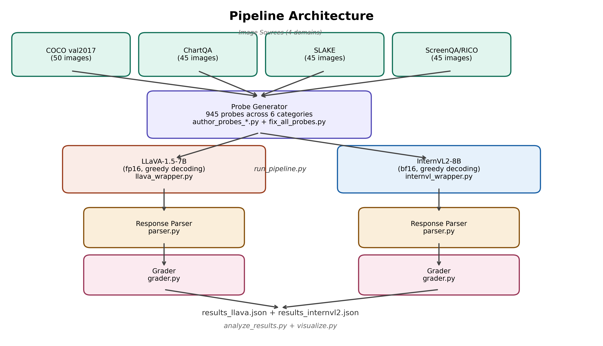
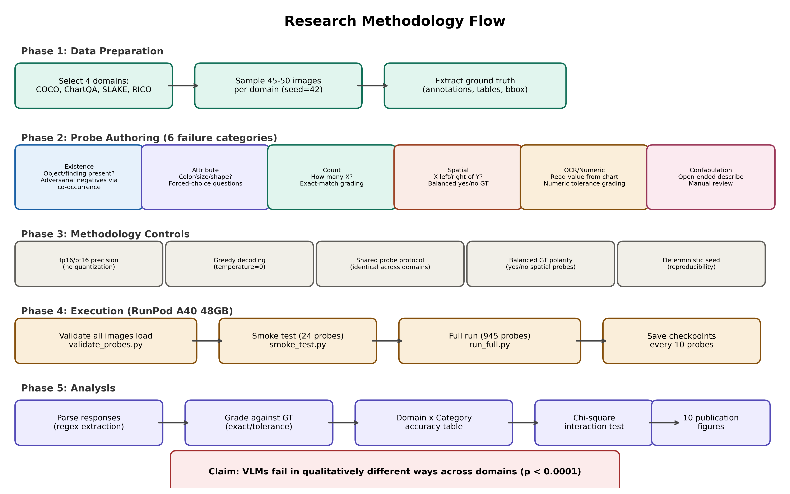
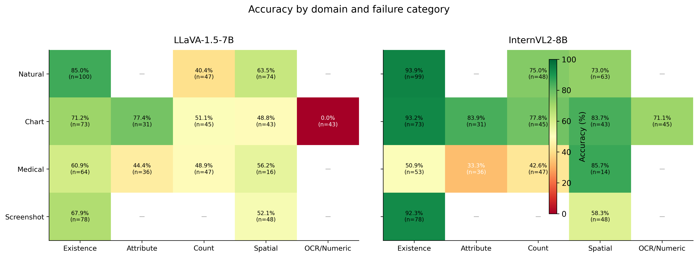
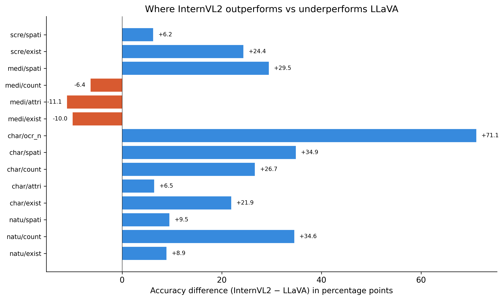
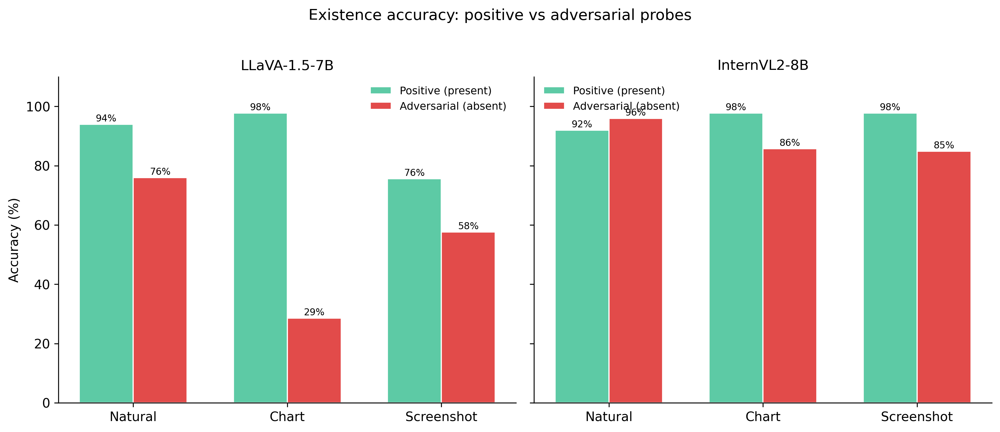
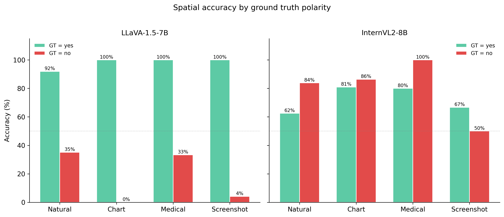
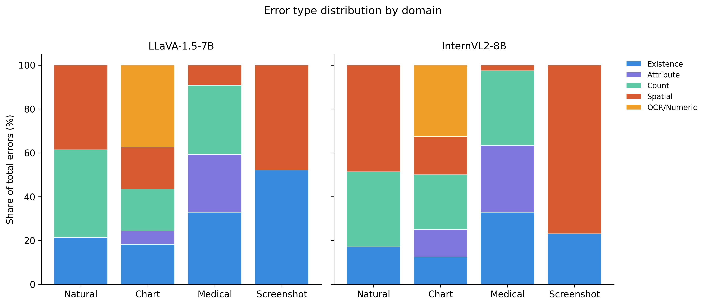
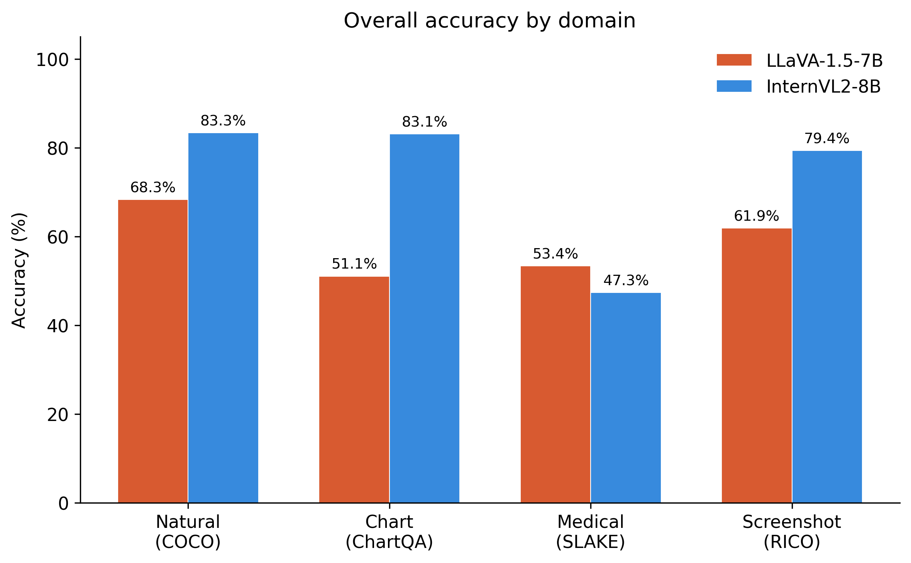

# VLM Hallucination Across Domain Shift

**Do vision-language models fail in qualitatively different ways when the image domain shifts?**

This project evaluates LLaVA-1.5-7B and InternVL2-8B across four image domains using a unified probe protocol with six failure categories. We find that both models exhibit statistically significant domain-dependent failure patterns (chi-square p < 0.0001), with the two architectures failing in fundamentally different ways on the same probes.

## Architecture



## Methodology



## Key findings

### 1. Domain shifts change failure *types*, not just accuracy



InternVL2 dominates on charts (83.1%) and natural photos (83.3%) but drops below LLaVA on medical images (47.3% vs 53.4%). The failure is not uniform — it's concentrated in different categories per domain.

### 2. Chart OCR is the sharpest capability divergence



LLaVA scores **0%** on chart OCR (fabricates numbers entirely), while InternVL2 scores 71.1% — a 71 percentage point gap. This represents a complete capability absence, not a gradual degradation.

### 3. LLaVA has severe yes-bias on adversarial probes



On chart adversarial existence probes (asking about categories NOT in the chart), LLaVA says "yes" 88% of the time, scoring only 29% accuracy. InternVL2 maintains 86% accuracy on the same probes.

### 4. Spatial reasoning collapses reveal yes-bias



With balanced spatial probes (equal yes/no ground truth), LLaVA shows near-100% accuracy on GT=yes but 0-35% on GT=no — it defaults to "yes" regardless of the actual spatial relationship. InternVL2 is more balanced but still drops on negative cases.

### 5. Error type distributions differ across domains



Chart errors for LLaVA are dominated by OCR failures. Medical errors are spread across categories. Screenshot errors are dominated by spatial and existence. The error *composition* changes, not just the rate.

### 6. Medical is the great equalizer (downward)



Both models collapse on medical images, but InternVL2 — despite being stronger everywhere else — actually performs worse than LLaVA on medical existence, attribute, and count. Domain-specific training data matters more than model capacity.

## Domains and datasets

| Domain | Dataset | Images | Ground truth source |
|--------|---------|--------|-------------------|
| Natural photos | COCO val2017 | 50 | Instance segmentation + object labels |
| Charts | ChartQA | 45 | Underlying data tables |
| Medical | SLAKE | 45 | Organ/finding masks + semantic labels |
| Screenshots | ScreenQA (RICO) | 45 | UI element bounding boxes + labels |

## Failure taxonomy

All probes use the same six categories across all domains for cross-domain comparability:

| Category | What it tests | Grading method |
|----------|--------------|----------------|
| Existence | Is X present? (with adversarial negatives) | Exact match (yes/no) |
| Attribute | Color, size, shape of X | Exact match + forced-choice parsing |
| Count | How many X? | Exact match (integer) |
| Spatial | Is X left/right of Y? (balanced yes/no GT) | Exact match (yes/no) |
| OCR/Numeric | Read a value from the image | Numeric tolerance (0.1) |
| Confabulation | Open-ended description | Manual review |

## Probe statistics

- **Total probes:** 945 (per model)
- **By domain:** Natural 274, Chart 282, Screenshot 171, Medical 218
- **By category:** Existence 325, Confabulation 185, Spatial 181, Count 142, Attribute 67, OCR/Numeric 45

## Model configuration

| Setting | LLaVA-1.5-7B | InternVL2-8B |
|---------|-------------|-------------|
| Precision | fp16 | bf16 |
| Decoding | Greedy (temperature=0) | Greedy (do_sample=False) |
| Quantization | None | None |
| Max tokens | 200 | 200 |
| GPU | A40 48GB | A40 48GB |

## Statistical validation

Chi-square test for domain x category interaction:
- **LLaVA:** chi2 = 172.12, p < 0.0001, dof = 12
- **InternVL2:** chi2 = 131.87, p < 0.0001, dof = 12

Both models show highly significant domain-dependent failure type distributions, confirming that domain shift changes *which* capabilities break, not just overall accuracy.

## Project structure

```
vlm-hallucination/
├── figures/                    # All generated figures (10 analysis + 2 diagrams)
│   ├── architecture.png
│   ├── methodology_flow.png
│   ├── fig1_heatmap.png        # Domain x category accuracy heatmap
│   ├── fig2_domain_overall.png # Overall accuracy by domain
│   ├── fig3_category_delta.png # InternVL2 - LLaVA accuracy delta
│   ├── fig4_adversarial.png    # Positive vs adversarial existence
│   ├── fig5_error_profile.png  # Error type distribution (stacked)
│   ├── fig6_spatial_balance.png# Spatial accuracy by GT polarity
│   ├── fig7_unparseable.png    # Unparseable response rates
│   ├── fig8_model_radar.png    # Radar capability profiles
│   ├── fig9_yes_bias.png       # Yes-response proportion
│   └── fig10_domain_shift.png  # Best vs worst domain per category
│
├── probes_all.json             # Master probe file (945 probes)
├── probes_coco.json            # COCO domain probes
├── probes_chartqa.json         # ChartQA domain probes
├── probes_screenqa.json        # ScreenQA domain probes
├── probes_slake.json           # SLAKE domain probes
│
├── results_llava.json          # Full LLaVA results (945 probes)
├── results_internvl2.json      # Full InternVL2 results (945 probes)
├── results_summary.csv         # Aggregated accuracy table
│
├── llava_wrapper.py            # LLaVA model wrapper (.ask interface)
├── internvl_wrapper.py         # InternVL2 model wrapper (.ask interface)
├── image_loader.py             # Domain-aware image loading
├── parser.py                   # Response parsing (yes/no, numbers, forced-choice)
├── grader.py                   # Answer grading (exact match, numeric tolerance)
├── run_pipeline.py             # Core inference loop with checkpointing
│
├── run_full.py                 # Orchestrator (subprocess isolation per model)
├── smoke_test.py               # Quick 24-probe validation before full run
├── validate_probes.py          # Pre-flight image loading check (CPU only)
├── test_locally.py             # 41-test suite (runs without GPU)
├── fix_all_probes.py           # Probe fixes (spatial balance, merge)
├── analyze_results.py          # Statistical analysis + CSV export
└── visualize.py                # Generate all 10 publication figures
```

## Reproduction

### Prerequisites

```bash
pip install transformers==4.45.2 accelerate pillow datasets huggingface_hub hf_transfer pycocotools scipy einops timm sentencepiece bitsandbytes matplotlib
```

Note: `transformers==4.45.2` is pinned for InternVL2 compatibility. Newer versions crash with its custom model code.

### Local validation (no GPU)

```bash
python test_locally.py          # 41 tests: images, parser, grader, mock pipeline
```

### Full run (RunPod A40)

```bash
python validate_probes.py       # Verify all images load
python smoke_test.py llava      # Quick 24-probe test
python run_full.py llava        # Full 945-probe run (~15-20 min)
python analyze_results.py results_llava.json
python visualize.py results_llava.json results_internvl2.json
```

### Combined analysis

```bash
python analyze_results.py results_llava.json results_internvl2.json
python visualize.py results_llava.json results_internvl2.json
```

## Known limitations

1. **Screenshot coverage gaps:** Count, attribute, and OCR categories are missing for the screenshot domain due to incomplete UI element annotations in RICO-ScreenQA.
2. **Natural photos:** No attribute probes (COCO lacks color ground truth) and no OCR probes (no text in natural photos).
3. **Medical OCR:** No OCR probes (no domain analog).
4. **COCO count annotation noise:** 3 probes have GT > 5 (including occluded instances that are arguably uncountable).
5. **SLAKE distractors:** Medical existence probes use SLAKE's native QA design, not the adversarial co-occurrence protocol used for other domains.
6. **Sample size:** 45-50 images per domain. Sufficient for detecting large effects (chi-square p < 0.0001) but may miss subtle patterns.

## All figures

| Figure | Description | Key insight |
|--------|------------|-------------|
| fig1 | Accuracy heatmap | Full domain x category landscape at a glance |
| fig2 | Domain overall bars | InternVL2 dominates except on medical |
| fig3 | Accuracy delta | Chart OCR (+71pp) is the largest divergence |
| fig4 | Adversarial existence | LLaVA 29% vs InternVL2 86% on chart adversarial |
| fig5 | Error type stacked bars | Error composition shifts across domains |
| fig6 | Spatial yes/no balance | LLaVA's extreme yes-bias exposed |
| fig7 | Unparseable rates | InternVL2 gives longer, harder-to-parse responses |
| fig8 | Radar profiles | Capability shape changes per domain |
| fig9 | Yes-bias analysis | LLaVA says "yes" 88% on charts |
| fig10 | Domain shift severity | Best-to-worst gap quantifies shift impact |
